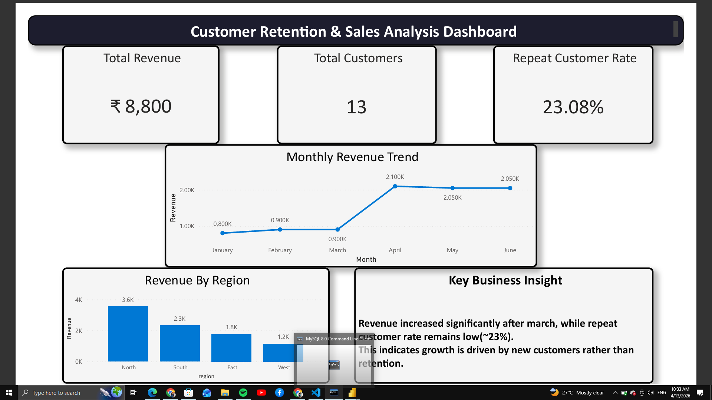

# Customer Retention & Sales Analysis

## 📌 Problem Statement
Analyze customer behavior and revenue trends to understand why repeat customers are low and identify key business insights.

---

## 📊 Dataset
- Total Records: 20
- Columns: order_id, customer_id, order_date, region, product_category, sales, profit

---

## 🛠 Tools Used
- SQL (MySQL)
- Power BI
- Excel

---

## 📈 Key Metrics
- Total Revenue: ₹8,800
- Total Customers: 13
- Repeat Customer Rate: 23.08%

---

## 📉 Key Insights
- Revenue increased significantly after March
- Growth is driven mainly by new customers
- Customer retention is low (~23%)

---

## 📊 Dashboard Preview

---
## 📌 Business Conclusion
Revenue growth is strong, but driven by new customers rather than repeat customers. Low retention (~23%) signals a need for customer engagement and loyalty strategies.

## 📢 Recommendations
- Introduce loyalty programs
- Target repeat purchase campaigns
- Improve customer experience

## 📂 Project Structure
